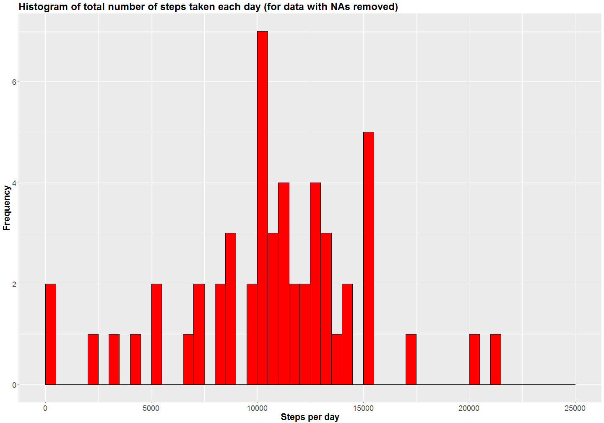
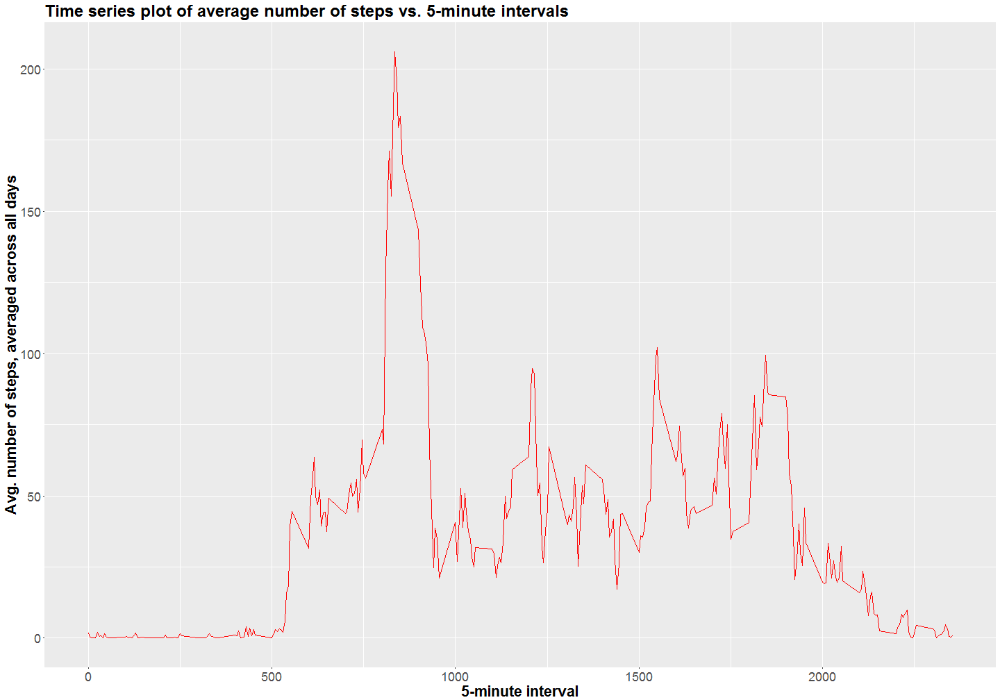
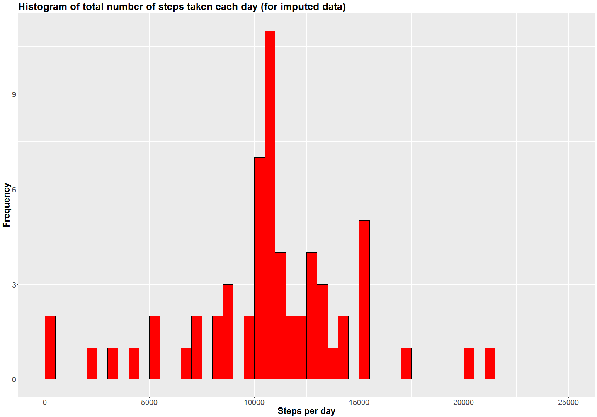
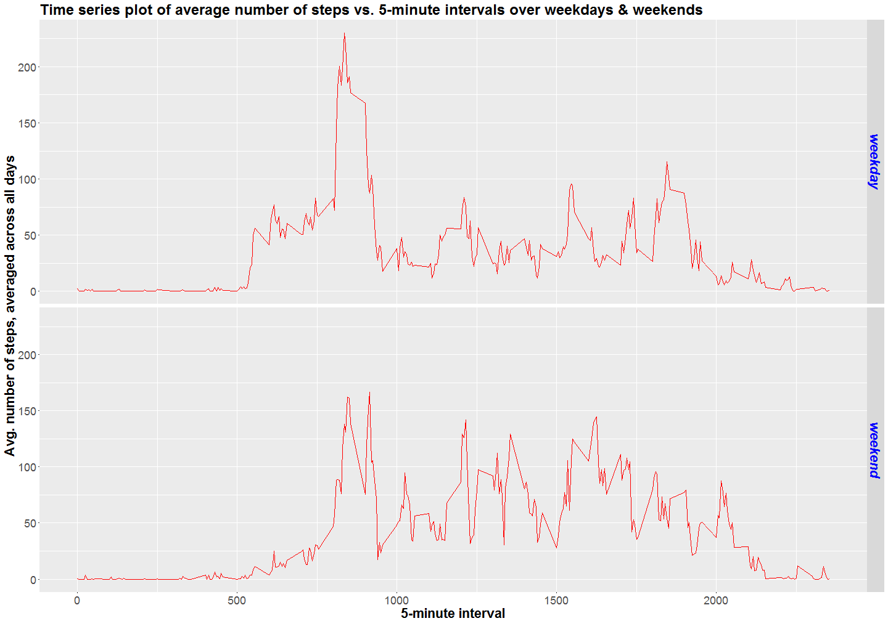

------------------------------------------------------------------------------------------------------------------

This report analyzes data over a 2 month period from a personal activity monitoring device that collects data at 
5-minute intervals throughout the day.  

## 1. Loading and preprocessing the data
  
The zip file containing raw data for the analysis is downloaded directly using R code from [here][1].
  
The following code chunk loads the required libraries, downloads the zip file, loads the raw data and transforms the
data into a format suitable for analysis. 


```r
rm(list = ls())
library(data.table)
library(ggplot2)

url <- "https://d396qusza40orc.cloudfront.net/repdata%2Fdata%2Factivity.zip"
download.file(url, destfile = "./activity.zip")
activity.data <- fread(unzip("./activity.zip", "activity.csv"), header = TRUE, na.strings = "NA")
clean.data <- na.omit(activity.data)
```
  
## 2. Mean total number of steps taken per day
  
The below code chunk calculates the total number of steps for each day for the dataset without missing values and plots 
a histogram of the same.  


```r
steps1.day <- aggregate(steps ~ date, clean.data, sum) 

ggplot(steps1.day, aes(steps1.day$steps)) + geom_histogram(breaks = seq(0, 25000, by = 500), col = "black", 
                                                                   fill = "red") +
          ggtitle("Histogram of total number of steps taken each day (for data with NAs removed)") + 
          theme(plot.title = element_text(size = 24, face = "bold")) + 
          theme(axis.text.x = element_text(size = 18), axis.title.x = element_text(size = 22, face = "bold")) + 
          theme(axis.text.y = element_text(size = 18), axis.title.y = element_text(size = 22, face = "bold")) + 
          ylab("Frequency") + xlab("Steps per day")
```


  
The below code chunk calculates the mean & median of total number of steps taken per day, for the dataset without 
missing values.  


```r
steps1.mean <- mean(steps1.day$steps)
steps1.median <- median(steps1.day$steps)
```
  
Mean of the total number of steps taken per day is 10766.189  
Median of the total number of steps taken per day is 10765  

## 3. Average daily activity pattern

The below code chunk makes a time series plot of the average number of steps taken, averaged across all days vs. the 
5-minute interval.   


```r
avgsteps.tseries <- aggregate(steps ~ interval, clean.data, mean)

ggplot(avgsteps.tseries, aes(x = interval, y = steps)) + geom_line(col = "red") + 
          ggtitle("Time series plot of average number of steps vs. 5-minute intervals") +
          theme(plot.title = element_text(size = 24, face = "bold")) + 
          theme(axis.text.x = element_text(size = 18), axis.title.x = element_text(size = 22, face = "bold")) + 
          theme(axis.text.y = element_text(size = 18), axis.title.y = element_text(size = 22, face = "bold")) + 
          ylab("Avg. number of steps, averaged across all days") + xlab("5-minute interval")
```



```r
stepmax.int <- avgsteps.tseries$interval[which.max(avgsteps.tseries$steps)]
```

The 5-minute interval, on average across all the days in the dataset, which contains the maximum number of steps is 
835
  
## 4. Imputing missing values

The below code chunk calculates the total number of missing values in the raw dataset and imputes the missing values by 
assigning values of the mean for the 5-minute intervals to them. A new dataset with all the missing values filled in is 
then created. The total number of steps for each day in the imputed dataset is calculated and a histogram of the same 
is plotted. 


```r
tot.missing <- sum(!complete.cases(activity.data))

impute.data <- activity.data
impute.data[is.na(impute.data$steps) == TRUE, ]$steps <- 
    avgsteps.tseries$steps[match(impute.data$interval, avgsteps.tseries$interval)]

steps2.day <- aggregate(steps ~ date, impute.data, sum)

ggplot(steps2.day, aes(steps2.day$steps)) + geom_histogram(breaks = seq(0, 25000, by = 500), col = "black", 
                                                                 fill = "red") +
          ggtitle("Histogram of total number of steps taken each day (for imputed data)") + 
          theme(plot.title = element_text(size = 24, face = "bold")) + 
          theme(axis.text.x = element_text(size = 18), axis.title.x = element_text(size = 22, face = "bold")) + 
          theme(axis.text.y = element_text(size = 18), axis.title.y = element_text(size = 22, face = "bold")) + 
          ylab("Frequency") + xlab("Steps per day")
```


  
The below code chunk calculates the mean & median of total number of steps taken per day, for the imputed dataset.


```r
steps2.mean <- mean(steps2.day$steps)
steps2.median <- median(steps2.day$steps)
```
  
Mean of the total number of steps taken per day is 10749.770  
Median of the total number of steps taken per day is 10641    
Imputing the missing data causes the mean and median of the total daily number of steps to decrease slightly.

  
## 5. Activity pattern: Weekdays vs. Weekends comparison  

The below code chunk provides a time series comparison of activity patterns over weekdays and weekends.  


```r
impute.data$days <- as.factor(ifelse(weekdays(as.Date(impute.data$date), abbreviate = FALSE) %in% 
                                         c("Saturday", "Sunday"), "weekend", "weekday"))

avgsteps.days <- aggregate(steps ~ (interval + days), impute.data, mean)

ggplot(avgsteps.days, aes(x = interval, y = steps)) + geom_line(col = "red") + 
          facet_grid(days ~ .) + 
          ggtitle("Time series plot of average number of steps vs. 5-minute intervals over weekdays & weekends") + 
          theme(plot.title = element_text(size = 24, face = "bold")) + 
          theme(axis.text.x = element_text(size = 18), axis.title.x = element_text(size = 22, face = "bold")) + 
          theme(axis.text.y = element_text(size = 18), axis.title.y = element_text(size = 22, face = "bold")) + 
          theme(strip.text.y = element_text(size = 22, color = "blue", face = "bold.italic")) + 
          ylab("Avg. number of steps, averaged across all days") + xlab("5-minute interval")
```




## That's all Folks!

<!--Set links below-->

[1]: https://d396qusza40orc.cloudfront.net/repdata%2Fdata%2Factivity.zip "here"
