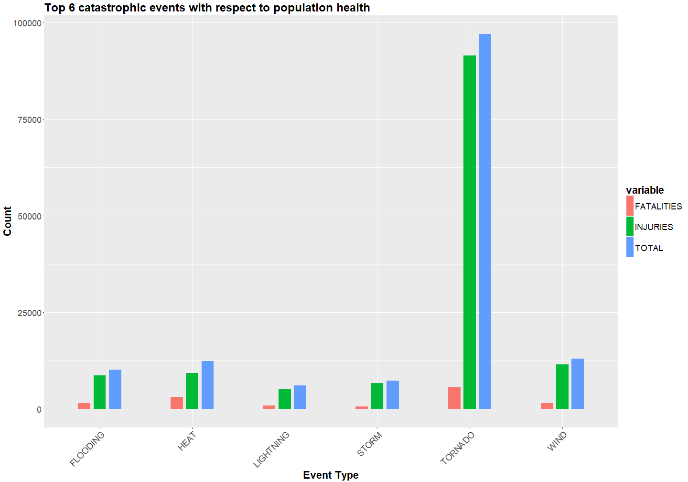
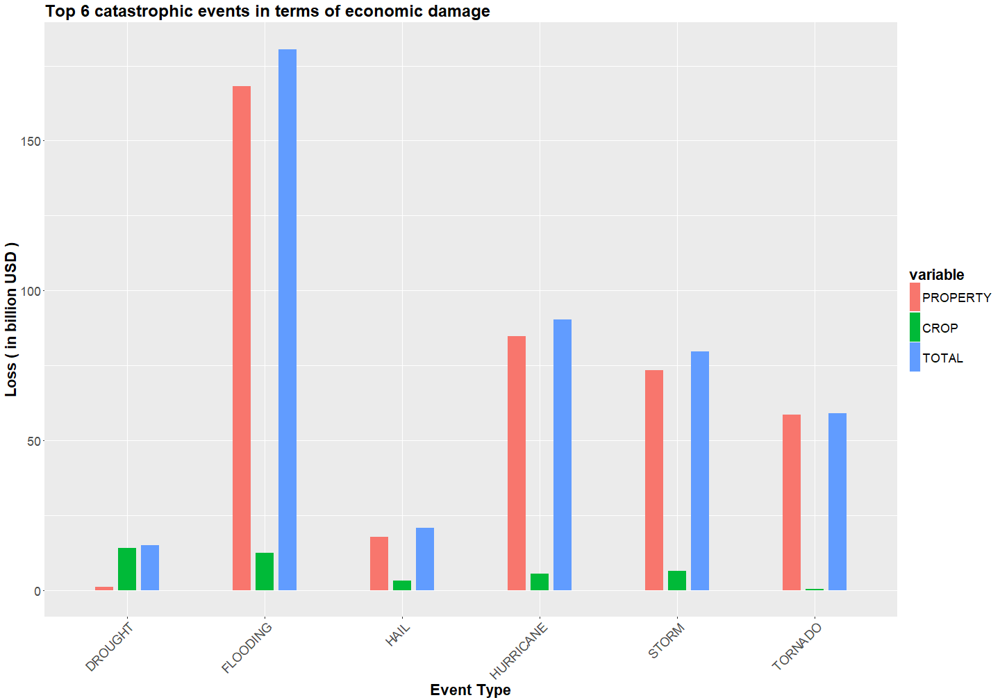

------------------------------------------------------------------------------------------------------------------

# Synopsis 

This report explores and analyzes data on severe weather events obtained from the U.S. National Oceanic and Atmospheric
Administration's (NOAA) Storm database. The data can be downloaded from [this link][1]. The events in the database 
start in the year 1950 and end in November 2011. Of particular interest to us in this analysis are observing the damage 
to life and economy caused by different weather events. The most catastrophic weather events with respect to public 
health and economic impact are then identified. This would aid in prioritizing resources for different types of events. 

# Data Processing

Contents of the data were viewed and analyzed with the help of a software package called **RStudio**. The R code 
downloads the zip file containing the data for you, extracts the contents of the file and loads the data into a 
readable tabular format using the **data.table** package. The code to do this is shown in the code chunk below:


```r
rm(list = ls())         # remove any variables in global environment 
library(data.table)     # load data.table package

url <- "https://d396qusza40orc.cloudfront.net/repdata%2Fdata%2FStormData.csv.bz2"   # set download link to the database
download.file(url, destfile = "./StormData.csv.bz2")            # download zip file with name as "StormData"

data.in <- data.table(read.csv("StormData.csv.bz2", stringsAsFactors = FALSE))      # read data into R
```

As far as the scope of this report goes, not all columns in the raw dataset are required. The raw dataset is broken 
down into 2 subsets: one to assess the impact of weather events on public health and another to assess the economic 
impact. 

The code chunk dealing with the public health subset, named "harm.health" is displayed below: 


```r
# create subset 1 by selecting event type, fatalities and injuries from raw dataset:
harm.health <- subset(data.in, select = c("EVTYPE", "FATALITIES", "INJURIES"))

# create a new column equal to the sum of fatalities and injuries:
harm.health$"TOTAL" <- harm.health$FATALITIES + harm.health$INJURIES

# calculate the sum of fatalities, injuries and total number of affected people for each event type:
harm.health <- aggregate(cbind(FATALITIES, INJURIES, TOTAL) ~ EVTYPE, harm.health, sum)

# arrange subset 1 in decreasing order of total number of affected people:
harm.health <- harm.health[order(-harm.health$TOTAL), ]
```

For the economic impact assessment, the damages are expressed in character values denoting hundreds, thousands, 
millions and billions. For a significant number of observations, the damages are not well documented or some garbage 
value is assigned. 

The code chunk for appropriately converting the character values to numeric values and obtaining subset, named 
"econ.clean", that deals with economic damage is displayed below:


```r
# take subset of event type, property and crop damage, property damage and crop damage multiplier exponent:
econ.data <- subset(data.in, select = c("EVTYPE", "PROPDMG", "PROPDMGEXP", "CROPDMG", "CROPDMGEXP"))

# create new column containing appropriate numeric values as depicted by character values of property damage exponent: 
econ.data$PMULT[econ.data$PROPDMGEXP == "" | econ.data$PROPDMGEXP == "-" | econ.data$PROPDMGEXP == "?" | 
                          econ.data$PROPDMGEXP == "+"] <- 0
econ.data$PMULT[econ.data$PROPDMGEXP == "0"] <- 10^0
econ.data$PMULT[econ.data$PROPDMGEXP == "1"] <- 10^1
econ.data$PMULT[econ.data$PROPDMGEXP == "2" | econ.data$PROPDMGEXP == "h" | econ.data$PROPDMGEXP == "H"] <- 10^2
econ.data$PMULT[econ.data$PROPDMGEXP == "3" | econ.data$PROPDMGEXP == "k" | econ.data$PROPDMGEXP == "K"] <- 10^3
econ.data$PMULT[econ.data$PROPDMGEXP == "4"] <- 10^4
econ.data$PMULT[econ.data$PROPDMGEXP == "5"] <- 10^5
econ.data$PMULT[econ.data$PROPDMGEXP == "6" | econ.data$PROPDMGEXP == "m" | econ.data$PROPDMGEXP == "M"] <- 10^6
econ.data$PMULT[econ.data$PROPDMGEXP == "7"] <- 10^7
econ.data$PMULT[econ.data$PROPDMGEXP == "8"] <- 10^8
econ.data$PMULT[econ.data$PROPDMGEXP == "b" | econ.data$PROPDMGEXP == "B"] <- 10^9

# create new column containing appropriate numeric values as depicted by character values of crop damage exponent:
econ.data$CMULT[econ.data$CROPDMGEXP == "" | econ.data$CROPDMGEXP == "?"] <- 0
econ.data$CMULT[econ.data$CROPDMGEXP == "0"] <- 10^0
econ.data$CMULT[econ.data$CROPDMGEXP == "2"] <- 10^2
econ.data$CMULT[econ.data$CROPDMGEXP == "k" | econ.data$CROPDMGEXP == "K"] <- 10^3
econ.data$CMULT[econ.data$CROPDMGEXP == "m" | econ.data$CROPDMGEXP == "M"] <- 10^6
econ.data$CMULT[econ.data$CROPDMGEXP == "B"] <- 10^9

# calculate total amount of damage to property and damage to crops:
econ.data$PROPERTY <- econ.data$PROPDMG * econ.data$PMULT
econ.data$CROP <- econ.data$CROPDMG * econ.data$CMULT

# create subset 2 by selecting event type, property damage amount and crop damage amount from "econ.data" subset:
econ.clean <- subset(econ.data, select = c("EVTYPE", "PROPERTY", "CROP"))

# create a new column equal to the sum of property damage amount and crop damage amount:
econ.clean$"TOTAL" <- econ.clean$PROPERTY + econ.clean$CROP

# calculate the sum of property, crop and overall damage amounts for each event type:
econ.clean <- aggregate(cbind(PROPERTY, CROP, TOTAL) ~ EVTYPE, econ.clean, sum)

# arrange subset 2 in decreasing order of total property and crop damage amount:
econ.clean <- econ.clean[order(-econ.clean$TOTAL), ]
```

# Results

A snapshot of the top 10 weather events that have the most severe impact on population health and economic damage is 
shown below:


```r
head(harm.health, n = 10)
```

```
##                EVTYPE FATALITIES INJURIES TOTAL
## 834           TORNADO       5633    91346 96979
## 130    EXCESSIVE HEAT       1903     6525  8428
## 856         TSTM WIND        504     6957  7461
## 170             FLOOD        470     6789  7259
## 464         LIGHTNING        816     5230  6046
## 275              HEAT        937     2100  3037
## 153       FLASH FLOOD        978     1777  2755
## 427         ICE STORM         89     1975  2064
## 760 THUNDERSTORM WIND        133     1488  1621
## 972      WINTER STORM        206     1321  1527
```

```r
head(econ.clean, n = 10)
```

```
##                EVTYPE     PROPERTY        CROP        TOTAL
## 170             FLOOD 144657709800  5661968450 150319678250
## 411 HURRICANE/TYPHOON  69305840000  2607872800  71913712800
## 834           TORNADO  56947380614   414953270  57362333884
## 670       STORM SURGE  43323536000        5000  43323541000
## 244              HAIL  15735267456  3025954470  18761221926
## 153       FLASH FLOOD  16822673772  1421317100  18243990872
## 95            DROUGHT   1046106000 13972566000  15018672000
## 402         HURRICANE  11868319010  2741910000  14610229010
## 590       RIVER FLOOD   5118945500  5029459000  10148404500
## 427         ICE STORM   3944927860  5022113500   8967041360
```


```r
# event causing most number of fatalities 
harm.health[which.max(harm.health$FATALITIES), ]
```

```
##      EVTYPE FATALITIES INJURIES TOTAL
## 834 TORNADO       5633    91346 96979
```

```r
# event causing most number of injuries 
harm.health[which.max(harm.health$INJURIES), ]
```

```
##      EVTYPE FATALITIES INJURIES TOTAL
## 834 TORNADO       5633    91346 96979
```

```r
# event causing most number of fatalities and injuries combined
harm.health[which.max(harm.health$TOTAL), ]
```

```
##      EVTYPE FATALITIES INJURIES TOTAL
## 834 TORNADO       5633    91346 96979
```

```r
# event causing most damage to property
econ.clean[which.max(econ.clean$PROPERTY), ]
```

```
##     EVTYPE     PROPERTY       CROP        TOTAL
## 170  FLOOD 144657709800 5661968450 150319678250
```

```r
# event causing most damage to crops
econ.clean[which.max(econ.clean$CROP), ]
```

```
##     EVTYPE   PROPERTY        CROP       TOTAL
## 95 DROUGHT 1046106000 13972566000 15018672000
```

```r
# event causing most damage to property and crops combined
econ.clean[which.max(econ.clean$TOTAL), ]
```

```
##     EVTYPE     PROPERTY       CROP        TOTAL
## 170  FLOOD 144657709800 5661968450 150319678250
```

From these tables, we can observe that:  
- **Tornadoes** cause the most number of fatalities  
- **Tornadoes** cause the most number of injuries  
- **Tornadoes** cause the most number of fatalities combined  
- **Floods** cause the most damage to property  
- **Droughts** cause the most damage to crops  
- **Floods** cause the most damage to property and crops combined  

Let us take a look at the names of all severe weather events:


```r
harm.health$EVTYPE
```

```
##   [1] "TORNADO"                        "EXCESSIVE HEAT"                
##   [3] "TSTM WIND"                      "FLOOD"                         
##   [5] "LIGHTNING"                      "HEAT"                          
##   [7] "FLASH FLOOD"                    "ICE STORM"                     
##   [9] "THUNDERSTORM WIND"              "WINTER STORM"                  
##  [11] "HIGH WIND"                      "HAIL"                          
##  [13] "HURRICANE/TYPHOON"              "HEAVY SNOW"                    
##  [15] "WILDFIRE"                       "THUNDERSTORM WINDS"            
##  [17] "BLIZZARD"                       "FOG"                           
##  [19] "RIP CURRENT"                    "WILD/FOREST FIRE"              
##  [21] "RIP CURRENTS"                   "HEAT WAVE"                     
##  [23] "DUST STORM"                     "WINTER WEATHER"                
##  [25] "TROPICAL STORM"                 "AVALANCHE"                     
##  [27] "EXTREME COLD"                   "STRONG WIND"                   
##  [29] "DENSE FOG"                      "HEAVY RAIN"                    
##  [31] "HIGH WINDS"                     "HIGH SURF"                     
##  [33] "EXTREME HEAT"                   "GLAZE"                         
##  [35] "TSUNAMI"                        "WILD FIRES"                    
##  [37] "EXTREME COLD/WIND CHILL"        "ICE"                           
##  [39] "WIND"                           "COLD/WIND CHILL"               
##  [41] "HURRICANE"                      "URBAN/SML STREAM FLD"          
##  [43] "TSTM WIND/HAIL"                 "WINTER WEATHER/MIX"            
##  [45] "HEAVY SURF/HIGH SURF"           "LANDSLIDE"                     
##  [47] "COLD"                           "WINTRY MIX"                    
##  [49] "Heat Wave"                      "WINTER WEATHER MIX"            
##  [51] "RECORD HEAT"                    "STORM SURGE"                   
##  [53] "TROPICAL STORM GORDON"          "HEAVY SURF"                    
##  [55] "WATERSPOUT/TORNADO"             "DUST DEVIL"                    
##  [57] "SNOW SQUALL"                    "ICY ROADS"                     
##  [59] "MARINE STRONG WIND"             "MARINE THUNDERSTORM WIND"      
##  [61] "SNOW/HIGH WINDS"                "SNOW"                          
##  [63] "FLOOD/FLASH FLOOD"              "WATERSPOUT"                    
##  [65] "DRY MICROBURST"                 "FREEZING RAIN"                 
##  [67] "UNSEASONABLY WARM AND DRY"      "MIXED PRECIP"                  
##  [69] "STRONG WINDS"                   "UNSEASONABLY WARM"             
##  [71] "FLASH FLOODING"                 "THUNDERSTORMW"                 
##  [73] "WINTER STORMS"                  "BLACK ICE"                     
##  [75] "TORNADOES, TSTM WIND, HAIL"     "EXCESSIVE RAINFALL"            
##  [77] "HIGH WIND AND SEAS"             "EXTREME WINDCHILL"             
##  [79] "HEAT WAVE DROUGHT"              "FREEZING DRIZZLE"              
##  [81] "MARINE TSTM WIND"               "RECORD/EXCESSIVE HEAT"         
##  [83] "STORM SURGE/TIDE"               "TORNADO F2"                    
##  [85] "WINTER STORM HIGH WINDS"        "GLAZE/ICE STORM"               
##  [87] "BLOWING SNOW"                   "COLD AND SNOW"                 
##  [89] "FLASH FLOOD/FLOOD"              "HIGH SEAS"                     
##  [91] "ROUGH SEAS"                     "THUNDERSTORM"                  
##  [93] "GUSTY WINDS"                    "MARINE MISHAP"                 
##  [95] "HEAVY SNOW/ICE"                 "SMALL HAIL"                    
##  [97] "THUNDERSTORM  WINDS"            "HIGH WINDS/SNOW"               
##  [99] "FLOODING"                       "High Surf"                     
## [101] "HURRICANE ERIN"                 "LOW TEMPERATURE"               
## [103] "NON-SEVERE WIND DAMAGE"         "Mudslide"                      
## [105] "RAIN/SNOW"                      "COASTAL FLOOD"                 
## [107] "COASTAL FLOODING/EROSION"       "COLD WEATHER"                  
## [109] "FLASH FLOODING/FLOOD"           "HEAT WAVES"                    
## [111] "RIP CURRENTS/HEAVY SURF"        "ROUGH SURF"                    
## [113] "SNOW AND ICE"                   "TYPHOON"                       
## [115] "COASTAL STORM"                  "DROUGHT"                       
## [117] "FROST"                          "HEAVY RAINS"                   
## [119] "HIGH WIND/SEAS"                 "HIGH WINDS/COLD"               
## [121] "Hypothermia/Exposure"           "OTHER"                         
## [123] "RIVER FLOOD"                    "THUNDERSTORM WINDSS"           
## [125] "Torrential Rainfall"            "Cold"                          
## [127] "COLD WAVE"                      "FUNNEL CLOUD"                  
## [129] "HEAVY SEAS"                     "Heavy surf and wind"           
## [131] "HIGH WATER"                     "HYPOTHERMIA/EXPOSURE"          
## [133] "LIGHT SNOW"                     "Marine Accident"               
## [135] "TSTM WIND (G45)"                "blowing snow"                  
## [137] "BRUSH FIRE"                     "Coastal Flooding"              
## [139] "Cold Temperature"               "DROUGHT/EXCESSIVE HEAT"        
## [141] "EXCESSIVE SNOW"                 "Extreme Cold"                  
## [143] "FALLING SNOW/ICE"               "FLASH FLOODS"                  
## [145] "FOG AND COLD TEMPERATURES"      "GUSTY WIND"                    
## [147] "Gusty winds"                    "HEAVY SNOW AND HIGH WINDS"     
## [149] "Heavy snow shower"              "HURRICANE-GENERATED SWELLS"    
## [151] "Hurricane Edouard"              "HURRICANE OPAL"                
## [153] "HURRICANE OPAL/HIGH WINDS"      "ICE STORM/FLASH FLOOD"         
## [155] "LANDSLIDES"                     "MARINE HIGH WIND"              
## [157] "RIVER FLOODING"                 "ROGUE WAVE"                    
## [159] "SLEET"                          "Snow"                          
## [161] "THUNDERSNOW"                    "TORNADO F3"                    
## [163] "UNSEASONABLY COLD"              "WARM WEATHER"                  
## [165] "WINDS"                          "AVALANCE"                      
## [167] "COASTAL FLOODING"               "Coastal Storm"                 
## [169] "COASTALSTORM"                   "COLD/WINDS"                    
## [171] "DROWNING"                       "DRY MIRCOBURST WINDS"          
## [173] "Dust Devil"                     "Extended Cold"                 
## [175] "FLOOD & HEAVY RAIN"             "FLOOD/RIVER FLOOD"             
## [177] "FREEZE"                         "FREEZING RAIN/SNOW"            
## [179] "Freezing Spray"                 "Gusty Winds"                   
## [181] "HAZARDOUS SURF"                 "HEAVY SNOW/BLIZZARD/AVALANCHE" 
## [183] "Heavy Surf"                     "HIGH"                          
## [185] "HIGH SWELLS"                    "HIGH WAVES"                    
## [187] "HIGH WIND 48"                   "HIGH WIND/HEAVY SNOW"          
## [189] "HURRICANE EMILY"                "HURRICANE FELIX"               
## [191] "HYPERTHERMIA/EXPOSURE"          "HYPOTHERMIA"                   
## [193] "ICE ON ROAD"                    "ICE ROADS"                     
## [195] "LIGHTNING AND THUNDERSTORM WIN" "LIGHTNING INJURY"              
## [197] "LIGHTNING."                     "MINOR FLOODING"                
## [199] "Mudslides"                      "NON TSTM WIND"                 
## [201] "RAIN/WIND"                      "RAPIDLY RISING WATER"          
## [203] "RECORD COLD"                    "River Flooding"                
## [205] "Snow Squalls"                   "SNOW/ BITTER COLD"             
## [207] "Strong Winds"                   "THUNDERSTORM WIND (G40)"       
## [209] "THUNDERSTORM WIND G52"          "THUNDERSTORM WINDS 13"         
## [211] "THUNDERSTORM WINDS/HAIL"        "THUNDERSTORMS WINDS"           
## [213] "THUNDERTORM WINDS"              "TIDAL FLOODING"                
## [215] "TSTM WIND (G35)"                "TSTM WIND (G40)"               
## [217] "URBAN AND SMALL STREAM FLOODIN" "WATERSPOUT TORNADO"            
## [219] "Whirlwind"                      "WIND STORM"                    
## [221] "   HIGH SURF ADVISORY"          " COASTAL FLOOD"                
## [223] " FLASH FLOOD"                   " LIGHTNING"                    
## [225] " TSTM WIND"                     " TSTM WIND (G45)"              
## [227] " WATERSPOUT"                    " WIND"                         
## [229] "?"                              "ABNORMAL WARMTH"               
## [231] "ABNORMALLY DRY"                 "ABNORMALLY WET"                
## [233] "ACCUMULATED SNOWFALL"           "AGRICULTURAL FREEZE"           
## [235] "APACHE COUNTY"                  "ASTRONOMICAL HIGH TIDE"        
## [237] "ASTRONOMICAL LOW TIDE"          "BEACH EROSIN"                  
## [239] "Beach Erosion"                  "BEACH EROSION"                 
## [241] "BEACH EROSION/COASTAL FLOOD"    "BEACH FLOOD"                   
## [243] "BELOW NORMAL PRECIPITATION"     "BITTER WIND CHILL"             
## [245] "BITTER WIND CHILL TEMPERATURES" "Black Ice"                     
## [247] "BLIZZARD AND EXTREME WIND CHIL" "BLIZZARD AND HEAVY SNOW"       
## [249] "Blizzard Summary"               "BLIZZARD WEATHER"              
## [251] "BLIZZARD/FREEZING RAIN"         "BLIZZARD/HEAVY SNOW"           
## [253] "BLIZZARD/HIGH WIND"             "BLIZZARD/WINTER STORM"         
## [255] "BLOW-OUT TIDE"                  "BLOW-OUT TIDES"                
## [257] "BLOWING DUST"                   "Blowing Snow"                  
## [259] "BLOWING SNOW- EXTREME WIND CHI" "BLOWING SNOW & EXTREME WIND CH"
## [261] "BLOWING SNOW/EXTREME WIND CHIL" "BREAKUP FLOODING"              
## [263] "BRUSH FIRES"                    "COASTAL  FLOODING/EROSION"     
## [265] "COASTAL EROSION"                "Coastal Flood"                 
## [267] "coastal flooding"               "COASTAL SURGE"                 
## [269] "COASTAL/TIDAL FLOOD"            "COASTALFLOOD"                  
## [271] "COLD AIR FUNNEL"                "COLD AIR FUNNELS"              
## [273] "COLD AIR TORNADO"               "Cold and Frost"                
## [275] "COLD AND FROST"                 "COLD AND WET CONDITIONS"       
## [277] "COLD TEMPERATURES"              "COLD WIND CHILL TEMPERATURES"  
## [279] "COOL AND WET"                   "COOL SPELL"                    
## [281] "CSTL FLOODING/EROSION"          "DAM BREAK"                     
## [283] "DAM FAILURE"                    "Damaging Freeze"               
## [285] "DAMAGING FREEZE"                "DEEP HAIL"                     
## [287] "DENSE SMOKE"                    "DOWNBURST"                     
## [289] "DOWNBURST WINDS"                "DRIEST MONTH"                  
## [291] "Drifting Snow"                  "DRY"                           
## [293] "DRY CONDITIONS"                 "DRY HOT WEATHER"               
## [295] "DRY MICROBURST 50"              "DRY MICROBURST 53"             
## [297] "DRY MICROBURST 58"              "DRY MICROBURST 61"             
## [299] "DRY MICROBURST 84"              "DRY MICROBURST WINDS"          
## [301] "DRY PATTERN"                    "DRY SPELL"                     
## [303] "DRY WEATHER"                    "DRYNESS"                       
## [305] "DUST DEVEL"                     "DUST DEVIL WATERSPOUT"         
## [307] "DUST STORM/HIGH WINDS"          "DUSTSTORM"                     
## [309] "EARLY FREEZE"                   "Early Frost"                   
## [311] "EARLY FROST"                    "EARLY RAIN"                    
## [313] "EARLY SNOW"                     "Early snowfall"                
## [315] "EARLY SNOWFALL"                 "Erosion/Cstl Flood"            
## [317] "EXCESSIVE"                      "Excessive Cold"                
## [319] "EXCESSIVE HEAT/DROUGHT"         "EXCESSIVE PRECIPITATION"       
## [321] "EXCESSIVE RAIN"                 "EXCESSIVE WETNESS"             
## [323] "EXCESSIVELY DRY"                "EXTREME WIND CHILL"            
## [325] "EXTREME WIND CHILL/BLOWING SNO" "EXTREME WIND CHILLS"           
## [327] "EXTREME WINDCHILL TEMPERATURES" "EXTREME/RECORD COLD"           
## [329] "EXTREMELY WET"                  "FIRST FROST"                   
## [331] "FIRST SNOW"                     "FLASH FLOOD - HEAVY RAIN"      
## [333] "FLASH FLOOD FROM ICE JAMS"      "FLASH FLOOD LANDSLIDES"        
## [335] "FLASH FLOOD WINDS"              "FLASH FLOOD/"                  
## [337] "FLASH FLOOD/ FLOOD"             "FLASH FLOOD/ STREET"           
## [339] "FLASH FLOOD/HEAVY RAIN"         "FLASH FLOOD/LANDSLIDE"         
## [341] "FLASH FLOODING/THUNDERSTORM WI" "FLASH FLOOODING"               
## [343] "Flood"                          "FLOOD FLASH"                   
## [345] "FLOOD FLOOD/FLASH"              "FLOOD WATCH/"                  
## [347] "FLOOD/FLASH"                    "Flood/Flash Flood"             
## [349] "FLOOD/FLASH FLOODING"           "FLOOD/FLASH/FLOOD"             
## [351] "FLOOD/FLASHFLOOD"               "FLOOD/RAIN/WIND"               
## [353] "FLOOD/RAIN/WINDS"               "Flood/Strong Wind"             
## [355] "FLOODING/HEAVY RAIN"            "FLOODS"                        
## [357] "FOREST FIRES"                   "Freeze"                        
## [359] "Freezing drizzle"               "Freezing Drizzle"              
## [361] "FREEZING DRIZZLE AND FREEZING"  "Freezing Fog"                  
## [363] "FREEZING FOG"                   "Freezing rain"                 
## [365] "Freezing Rain"                  "FREEZING RAIN AND SLEET"       
## [367] "FREEZING RAIN AND SNOW"         "FREEZING RAIN SLEET AND"       
## [369] "FREEZING RAIN SLEET AND LIGHT"  "FREEZING RAIN/SLEET"           
## [371] "Frost"                          "Frost/Freeze"                  
## [373] "FROST/FREEZE"                   "FROST\\FREEZE"                 
## [375] "FUNNEL"                         "Funnel Cloud"                  
## [377] "FUNNEL CLOUD."                  "FUNNEL CLOUD/HAIL"             
## [379] "FUNNEL CLOUDS"                  "FUNNELS"                       
## [381] "Glaze"                          "GLAZE ICE"                     
## [383] "gradient wind"                  "Gradient wind"                 
## [385] "GRADIENT WIND"                  "GRADIENT WINDS"                
## [387] "GRASS FIRES"                    "GROUND BLIZZARD"               
## [389] "GUSTNADO"                       "GUSTNADO AND"                  
## [391] "GUSTY LAKE WIND"                "GUSTY THUNDERSTORM WIND"       
## [393] "GUSTY THUNDERSTORM WINDS"       "Gusty Wind"                    
## [395] "GUSTY WIND/HAIL"                "GUSTY WIND/HVY RAIN"           
## [397] "Gusty wind/rain"                "HAIL 0.75"                     
## [399] "HAIL 0.88"                      "HAIL 075"                      
## [401] "HAIL 088"                       "HAIL 1.00"                     
## [403] "HAIL 1.75"                      "HAIL 1.75)"                    
## [405] "HAIL 100"                       "HAIL 125"                      
## [407] "HAIL 150"                       "HAIL 175"                      
## [409] "HAIL 200"                       "HAIL 225"                      
## [411] "HAIL 275"                       "HAIL 450"                      
## [413] "HAIL 75"                        "HAIL 80"                       
## [415] "HAIL 88"                        "HAIL ALOFT"                    
## [417] "HAIL DAMAGE"                    "HAIL FLOODING"                 
## [419] "HAIL STORM"                     "Hail(0.75)"                    
## [421] "HAIL/ICY ROADS"                 "HAIL/WIND"                     
## [423] "HAIL/WINDS"                     "HAILSTORM"                     
## [425] "HAILSTORMS"                     "HARD FREEZE"                   
## [427] "HEAT DROUGHT"                   "HEAT/DROUGHT"                  
## [429] "Heatburst"                      "HEAVY LAKE SNOW"               
## [431] "HEAVY MIX"                      "HEAVY PRECIPATATION"           
## [433] "Heavy Precipitation"            "HEAVY PRECIPITATION"           
## [435] "Heavy rain"                     "Heavy Rain"                    
## [437] "HEAVY RAIN AND FLOOD"           "Heavy Rain and Wind"           
## [439] "HEAVY RAIN EFFECTS"             "HEAVY RAIN/FLOODING"           
## [441] "Heavy Rain/High Surf"           "HEAVY RAIN/LIGHTNING"          
## [443] "HEAVY RAIN/MUDSLIDES/FLOOD"     "HEAVY RAIN/SEVERE WEATHER"     
## [445] "HEAVY RAIN/SMALL STREAM URBAN"  "HEAVY RAIN/SNOW"               
## [447] "HEAVY RAIN/URBAN FLOOD"         "HEAVY RAIN/WIND"               
## [449] "HEAVY RAIN; URBAN FLOOD WINDS;" "HEAVY RAINFALL"                
## [451] "HEAVY RAINS/FLOODING"           "HEAVY SHOWER"                  
## [453] "HEAVY SHOWERS"                  "HEAVY SNOW-SQUALLS"            
## [455] "HEAVY SNOW   FREEZING RAIN"     "HEAVY SNOW & ICE"              
## [457] "HEAVY SNOW AND"                 "HEAVY SNOW AND ICE"            
## [459] "HEAVY SNOW AND ICE STORM"       "HEAVY SNOW AND STRONG WINDS"   
## [461] "HEAVY SNOW ANDBLOWING SNOW"     "HEAVY SNOW SQUALLS"            
## [463] "HEAVY SNOW/BLIZZARD"            "HEAVY SNOW/BLOWING SNOW"       
## [465] "HEAVY SNOW/FREEZING RAIN"       "HEAVY SNOW/HIGH"               
## [467] "HEAVY SNOW/HIGH WIND"           "HEAVY SNOW/HIGH WINDS"         
## [469] "HEAVY SNOW/HIGH WINDS & FLOOD"  "HEAVY SNOW/HIGH WINDS/FREEZING"
## [471] "HEAVY SNOW/ICE STORM"           "HEAVY SNOW/SLEET"              
## [473] "HEAVY SNOW/SQUALLS"             "HEAVY SNOW/WIND"               
## [475] "HEAVY SNOW/WINTER STORM"        "HEAVY SNOWPACK"                
## [477] "HEAVY SURF COASTAL FLOODING"    "HEAVY SWELLS"                  
## [479] "HEAVY WET SNOW"                 "HIGH  SWELLS"                  
## [481] "HIGH  WINDS"                    "HIGH SURF ADVISORIES"          
## [483] "HIGH SURF ADVISORY"             "HIGH TEMPERATURE RECORD"       
## [485] "HIGH TIDES"                     "High Wind"                     
## [487] "HIGH WIND (G40)"                "HIGH WIND 63"                  
## [489] "HIGH WIND 70"                   "HIGH WIND AND HEAVY SNOW"      
## [491] "HIGH WIND AND HIGH TIDES"       "HIGH WIND DAMAGE"              
## [493] "HIGH WIND/ BLIZZARD"            "HIGH WIND/BLIZZARD"            
## [495] "HIGH WIND/BLIZZARD/FREEZING RA" "HIGH WIND/LOW WIND CHILL"      
## [497] "HIGH WIND/WIND CHILL"           "HIGH WIND/WIND CHILL/BLIZZARD" 
## [499] "HIGH WINDS 55"                  "HIGH WINDS 57"                 
## [501] "HIGH WINDS 58"                  "HIGH WINDS 63"                 
## [503] "HIGH WINDS 66"                  "HIGH WINDS 67"                 
## [505] "HIGH WINDS 73"                  "HIGH WINDS 76"                 
## [507] "HIGH WINDS 80"                  "HIGH WINDS 82"                 
## [509] "HIGH WINDS AND WIND CHILL"      "HIGH WINDS DUST STORM"         
## [511] "HIGH WINDS HEAVY RAINS"         "HIGH WINDS/"                   
## [513] "HIGH WINDS/COASTAL FLOOD"       "HIGH WINDS/FLOODING"           
## [515] "HIGH WINDS/HEAVY RAIN"          "HIGHWAY FLOODING"              
## [517] "Hot and Dry"                    "HOT PATTERN"                   
## [519] "HOT SPELL"                      "HOT WEATHER"                   
## [521] "HOT/DRY PATTERN"                "HURRICANE GORDON"              
## [523] "HVY RAIN"                       "ICE AND SNOW"                  
## [525] "ICE FLOES"                      "Ice Fog"                       
## [527] "ICE JAM"                        "Ice jam flood (minor"          
## [529] "ICE JAM FLOODING"               "ICE PELLETS"                   
## [531] "ICE STORM AND SNOW"             "Ice/Snow"                      
## [533] "ICE/SNOW"                       "ICE/STRONG WINDS"              
## [535] "Icestorm/Blizzard"              "Icy Roads"                     
## [537] "LACK OF SNOW"                   "LAKE-EFFECT SNOW"              
## [539] "Lake Effect Snow"               "LAKE EFFECT SNOW"              
## [541] "LAKE FLOOD"                     "LAKESHORE FLOOD"               
## [543] "LANDSLIDE/URBAN FLOOD"          "Landslump"                     
## [545] "LANDSLUMP"                      "LANDSPOUT"                     
## [547] "LARGE WALL CLOUD"               "Late-season Snowfall"          
## [549] "LATE FREEZE"                    "LATE SEASON HAIL"              
## [551] "LATE SEASON SNOW"               "Late Season Snowfall"          
## [553] "LATE SNOW"                      "LIGHT FREEZING RAIN"           
## [555] "Light snow"                     "Light Snow"                    
## [557] "LIGHT SNOW AND SLEET"           "Light Snow/Flurries"           
## [559] "LIGHT SNOW/FREEZING PRECIP"     "Light Snowfall"                
## [561] "LIGHTING"                       "LIGHTNING  WAUSEON"            
## [563] "LIGHTNING AND HEAVY RAIN"       "LIGHTNING AND WINDS"           
## [565] "LIGHTNING DAMAGE"               "LIGHTNING FIRE"                
## [567] "LIGHTNING THUNDERSTORM WINDS"   "LIGHTNING THUNDERSTORM WINDSS" 
## [569] "LIGHTNING/HEAVY RAIN"           "LIGNTNING"                     
## [571] "LOCAL FLASH FLOOD"              "LOCAL FLOOD"                   
## [573] "LOCALLY HEAVY RAIN"             "LOW TEMPERATURE RECORD"        
## [575] "LOW WIND CHILL"                 "MAJOR FLOOD"                   
## [577] "MARINE HAIL"                    "Metro Storm, May 26"           
## [579] "Microburst"                     "MICROBURST"                    
## [581] "MICROBURST WINDS"               "Mild and Dry Pattern"          
## [583] "MILD PATTERN"                   "MILD/DRY PATTERN"              
## [585] "MINOR FLOOD"                    "Minor Flooding"                
## [587] "Mixed Precipitation"            "MIXED PRECIPITATION"           
## [589] "MODERATE SNOW"                  "MODERATE SNOWFALL"             
## [591] "MONTHLY PRECIPITATION"          "Monthly Rainfall"              
## [593] "MONTHLY RAINFALL"               "Monthly Snowfall"              
## [595] "MONTHLY SNOWFALL"               "MONTHLY TEMPERATURE"           
## [597] "Mountain Snows"                 "MUD SLIDE"                     
## [599] "MUD SLIDES"                     "MUD SLIDES URBAN FLOODING"     
## [601] "MUD/ROCK SLIDE"                 "MUDSLIDE"                      
## [603] "MUDSLIDE/LANDSLIDE"             "MUDSLIDES"                     
## [605] "NEAR RECORD SNOW"               "No Severe Weather"             
## [607] "NON-TSTM WIND"                  "NON SEVERE HAIL"               
## [609] "NONE"                           "NORMAL PRECIPITATION"          
## [611] "NORTHERN LIGHTS"                "Other"                         
## [613] "PATCHY DENSE FOG"               "PATCHY ICE"                    
## [615] "Prolong Cold"                   "PROLONG COLD"                  
## [617] "PROLONG COLD/SNOW"              "PROLONG WARMTH"                
## [619] "PROLONGED RAIN"                 "RAIN"                          
## [621] "RAIN (HEAVY)"                   "RAIN AND WIND"                 
## [623] "Rain Damage"                    "RAINSTORM"                     
## [625] "RECORD  COLD"                   "Record Cold"                   
## [627] "RECORD COLD AND HIGH WIND"      "RECORD COLD/FROST"             
## [629] "RECORD COOL"                    "Record dry month"              
## [631] "RECORD DRYNESS"                 "Record Heat"                   
## [633] "RECORD HEAT WAVE"               "Record High"                   
## [635] "RECORD HIGH"                    "RECORD HIGH TEMPERATURE"       
## [637] "RECORD HIGH TEMPERATURES"       "RECORD LOW"                    
## [639] "RECORD LOW RAINFALL"            "Record May Snow"               
## [641] "RECORD PRECIPITATION"           "RECORD RAINFALL"               
## [643] "RECORD SNOW"                    "RECORD SNOW/COLD"              
## [645] "RECORD SNOWFALL"                "Record temperature"            
## [647] "RECORD TEMPERATURE"             "Record Temperatures"           
## [649] "RECORD TEMPERATURES"            "RECORD WARM"                   
## [651] "RECORD WARM TEMPS."             "Record Warmth"                 
## [653] "RECORD WARMTH"                  "Record Winter Snow"            
## [655] "RECORD/EXCESSIVE RAINFALL"      "RED FLAG CRITERIA"             
## [657] "RED FLAG FIRE WX"               "REMNANTS OF FLOYD"             
## [659] "RIP CURRENTS HEAVY SURF"        "RIVER AND STREAM FLOOD"        
## [661] "ROCK SLIDE"                     "ROTATING WALL CLOUD"           
## [663] "RURAL FLOOD"                    "Saharan Dust"                  
## [665] "SAHARAN DUST"                   "Seasonal Snowfall"             
## [667] "SEICHE"                         "SEVERE COLD"                   
## [669] "SEVERE THUNDERSTORM"            "SEVERE THUNDERSTORM WINDS"     
## [671] "SEVERE THUNDERSTORMS"           "SEVERE TURBULENCE"             
## [673] "SLEET & FREEZING RAIN"          "SLEET STORM"                   
## [675] "SLEET/FREEZING RAIN"            "SLEET/ICE STORM"               
## [677] "SLEET/RAIN/SNOW"                "SLEET/SNOW"                    
## [679] "small hail"                     "Small Hail"                    
## [681] "SMALL STREAM"                   "SMALL STREAM AND"              
## [683] "SMALL STREAM AND URBAN FLOOD"   "SMALL STREAM AND URBAN FLOODIN"
## [685] "SMALL STREAM FLOOD"             "SMALL STREAM FLOODING"         
## [687] "SMALL STREAM URBAN FLOOD"       "SMALL STREAM/URBAN FLOOD"      
## [689] "Sml Stream Fld"                 "SMOKE"                         
## [691] "SNOW- HIGH WIND- WIND CHILL"    "Snow Accumulation"             
## [693] "SNOW ACCUMULATION"              "SNOW ADVISORY"                 
## [695] "SNOW AND COLD"                  "SNOW AND HEAVY SNOW"           
## [697] "Snow and Ice"                   "SNOW AND ICE STORM"            
## [699] "Snow and sleet"                 "SNOW AND SLEET"                
## [701] "SNOW AND WIND"                  "SNOW DROUGHT"                  
## [703] "SNOW FREEZING RAIN"             "SNOW SHOWERS"                  
## [705] "SNOW SLEET"                     "Snow squalls"                  
## [707] "SNOW SQUALLS"                   "SNOW/ ICE"                     
## [709] "SNOW/BLOWING SNOW"              "SNOW/COLD"                     
## [711] "SNOW/FREEZING RAIN"             "SNOW/HEAVY SNOW"               
## [713] "SNOW/ICE"                       "SNOW/ICE STORM"                
## [715] "SNOW/RAIN"                      "SNOW/RAIN/SLEET"               
## [717] "SNOW/SLEET"                     "SNOW/SLEET/FREEZING RAIN"      
## [719] "SNOW/SLEET/RAIN"                "SNOW\\COLD"                    
## [721] "SNOWFALL RECORD"                "SNOWMELT FLOODING"             
## [723] "SNOWSTORM"                      "SOUTHEAST"                     
## [725] "STORM FORCE WINDS"              "STREAM FLOODING"               
## [727] "STREET FLOOD"                   "STREET FLOODING"               
## [729] "Strong Wind"                    "STRONG WIND GUST"              
## [731] "Strong winds"                   "Summary August 10"             
## [733] "Summary August 11"              "Summary August 17"             
## [735] "Summary August 2-3"             "Summary August 21"             
## [737] "Summary August 28"              "Summary August 4"              
## [739] "Summary August 7"               "Summary August 9"              
## [741] "Summary Jan 17"                 "Summary July 23-24"            
## [743] "Summary June 18-19"             "Summary June 5-6"              
## [745] "Summary June 6"                 "Summary of April 12"           
## [747] "Summary of April 13"            "Summary of April 21"           
## [749] "Summary of April 27"            "Summary of April 3rd"          
## [751] "Summary of August 1"            "Summary of July 11"            
## [753] "Summary of July 2"              "Summary of July 22"            
## [755] "Summary of July 26"             "Summary of July 29"            
## [757] "Summary of July 3"              "Summary of June 10"            
## [759] "Summary of June 11"             "Summary of June 12"            
## [761] "Summary of June 13"             "Summary of June 15"            
## [763] "Summary of June 16"             "Summary of June 18"            
## [765] "Summary of June 23"             "Summary of June 24"            
## [767] "Summary of June 3"              "Summary of June 30"            
## [769] "Summary of June 4"              "Summary of June 6"             
## [771] "Summary of March 14"            "Summary of March 23"           
## [773] "Summary of March 24"            "SUMMARY OF MARCH 24-25"        
## [775] "SUMMARY OF MARCH 27"            "SUMMARY OF MARCH 29"           
## [777] "Summary of May 10"              "Summary of May 13"             
## [779] "Summary of May 14"              "Summary of May 22"             
## [781] "Summary of May 22 am"           "Summary of May 22 pm"          
## [783] "Summary of May 26 am"           "Summary of May 26 pm"          
## [785] "Summary of May 31 am"           "Summary of May 31 pm"          
## [787] "Summary of May 9-10"            "Summary Sept. 25-26"           
## [789] "Summary September 20"           "Summary September 23"          
## [791] "Summary September 3"            "Summary September 4"           
## [793] "Summary: Nov. 16"               "Summary: Nov. 6-7"             
## [795] "Summary: Oct. 20-21"            "Summary: October 31"           
## [797] "Summary: Sept. 18"              "Temperature record"            
## [799] "THUDERSTORM WINDS"              "THUNDEERSTORM WINDS"           
## [801] "THUNDERESTORM WINDS"            "Thundersnow shower"            
## [803] "THUNDERSTORM DAMAGE"            "THUNDERSTORM DAMAGE TO"        
## [805] "THUNDERSTORM HAIL"              "THUNDERSTORM W INDS"           
## [807] "Thunderstorm Wind"              "THUNDERSTORM WIND 50"          
## [809] "THUNDERSTORM WIND 52"           "THUNDERSTORM WIND 56"          
## [811] "THUNDERSTORM WIND 59"           "THUNDERSTORM WIND 59 MPH"      
## [813] "THUNDERSTORM WIND 59 MPH."      "THUNDERSTORM WIND 60 MPH"      
## [815] "THUNDERSTORM WIND 65 MPH"       "THUNDERSTORM WIND 65MPH"       
## [817] "THUNDERSTORM WIND 69"           "THUNDERSTORM WIND 98 MPH"      
## [819] "THUNDERSTORM WIND G50"          "THUNDERSTORM WIND G51"         
## [821] "THUNDERSTORM WIND G55"          "THUNDERSTORM WIND G60"         
## [823] "THUNDERSTORM WIND G61"          "THUNDERSTORM WIND TREES"       
## [825] "THUNDERSTORM WIND."             "THUNDERSTORM WIND/ TREE"       
## [827] "THUNDERSTORM WIND/ TREES"       "THUNDERSTORM WIND/AWNING"      
## [829] "THUNDERSTORM WIND/HAIL"         "THUNDERSTORM WIND/LIGHTNING"   
## [831] "THUNDERSTORM WINDS      LE CEN" "THUNDERSTORM WINDS 2"          
## [833] "THUNDERSTORM WINDS 50"          "THUNDERSTORM WINDS 52"         
## [835] "THUNDERSTORM WINDS 53"          "THUNDERSTORM WINDS 60"         
## [837] "THUNDERSTORM WINDS 61"          "THUNDERSTORM WINDS 62"         
## [839] "THUNDERSTORM WINDS 63 MPH"      "THUNDERSTORM WINDS AND"        
## [841] "THUNDERSTORM WINDS FUNNEL CLOU" "THUNDERSTORM WINDS G"          
## [843] "THUNDERSTORM WINDS G60"         "THUNDERSTORM WINDS HAIL"       
## [845] "THUNDERSTORM WINDS HEAVY RAIN"  "THUNDERSTORM WINDS LIGHTNING"  
## [847] "THUNDERSTORM WINDS SMALL STREA" "THUNDERSTORM WINDS URBAN FLOOD"
## [849] "THUNDERSTORM WINDS."            "THUNDERSTORM WINDS/ FLOOD"     
## [851] "THUNDERSTORM WINDS/ HAIL"       "THUNDERSTORM WINDS/FLASH FLOOD"
## [853] "THUNDERSTORM WINDS/FLOODING"    "THUNDERSTORM WINDS/FUNNEL CLOU"
## [855] "THUNDERSTORM WINDS/HEAVY RAIN"  "THUNDERSTORM WINDS53"          
## [857] "THUNDERSTORM WINDSHAIL"         "THUNDERSTORM WINS"             
## [859] "THUNDERSTORMS"                  "THUNDERSTORMS WIND"            
## [861] "THUNDERSTORMW 50"               "THUNDERSTORMW WINDS"           
## [863] "THUNDERSTORMWINDS"              "THUNDERSTROM WIND"             
## [865] "THUNDERSTROM WINDS"             "THUNDERTSORM WIND"             
## [867] "THUNDESTORM WINDS"              "THUNERSTORM WINDS"             
## [869] "TIDAL FLOOD"                    "Tidal Flooding"                
## [871] "TORNADO DEBRIS"                 "TORNADO F0"                    
## [873] "TORNADO F1"                     "TORNADO/WATERSPOUT"            
## [875] "TORNADOES"                      "TORNADOS"                      
## [877] "TORNDAO"                        "TORRENTIAL RAIN"               
## [879] "TROPICAL DEPRESSION"            "TROPICAL STORM ALBERTO"        
## [881] "TROPICAL STORM DEAN"            "TROPICAL STORM JERRY"          
## [883] "TSTM"                           "TSTM HEAVY RAIN"               
## [885] "Tstm Wind"                      "TSTM WIND  (G45)"              
## [887] "TSTM WIND (41)"                 "TSTM WIND 40"                  
## [889] "TSTM WIND 45"                   "TSTM WIND 50"                  
## [891] "TSTM WIND 51"                   "TSTM WIND 52"                  
## [893] "TSTM WIND 55"                   "TSTM WIND 65)"                 
## [895] "TSTM WIND AND LIGHTNING"        "TSTM WIND DAMAGE"              
## [897] "TSTM WIND G45"                  "TSTM WIND G58"                 
## [899] "TSTM WINDS"                     "TSTM WND"                      
## [901] "TSTMW"                          "TUNDERSTORM WIND"              
## [903] "Unseasonable Cold"              "UNSEASONABLY COOL"             
## [905] "UNSEASONABLY COOL & WET"        "UNSEASONABLY DRY"              
## [907] "UNSEASONABLY HOT"               "UNSEASONABLY WARM & WET"       
## [909] "UNSEASONABLY WARM YEAR"         "UNSEASONABLY WARM/WET"         
## [911] "UNSEASONABLY WET"               "UNSEASONAL LOW TEMP"           
## [913] "UNSEASONAL RAIN"                "UNUSUAL WARMTH"                
## [915] "UNUSUAL/RECORD WARMTH"          "UNUSUALLY COLD"                
## [917] "UNUSUALLY LATE SNOW"            "UNUSUALLY WARM"                
## [919] "URBAN AND SMALL"                "URBAN AND SMALL STREAM"        
## [921] "URBAN AND SMALL STREAM FLOOD"   "Urban flood"                   
## [923] "Urban Flood"                    "URBAN FLOOD"                   
## [925] "URBAN FLOOD LANDSLIDE"          "Urban Flooding"                
## [927] "URBAN FLOODING"                 "URBAN FLOODS"                  
## [929] "URBAN SMALL"                    "URBAN SMALL STREAM FLOOD"      
## [931] "URBAN/SMALL"                    "URBAN/SMALL FLOODING"          
## [933] "URBAN/SMALL STREAM"             "URBAN/SMALL STREAM  FLOOD"     
## [935] "URBAN/SMALL STREAM FLOOD"       "URBAN/SMALL STREAM FLOODING"   
## [937] "URBAN/SMALL STRM FLDG"          "URBAN/SML STREAM FLDG"         
## [939] "URBAN/STREET FLOODING"          "VERY DRY"                      
## [941] "VERY WARM"                      "VOG"                           
## [943] "Volcanic Ash"                   "VOLCANIC ASH"                  
## [945] "Volcanic Ash Plume"             "VOLCANIC ASHFALL"              
## [947] "VOLCANIC ERUPTION"              "WAKE LOW WIND"                 
## [949] "WALL CLOUD"                     "WALL CLOUD/FUNNEL CLOUD"       
## [951] "WARM DRY CONDITIONS"            "WATER SPOUT"                   
## [953] "WATERSPOUT-"                    "WATERSPOUT-TORNADO"            
## [955] "WATERSPOUT FUNNEL CLOUD"        "WATERSPOUT/"                   
## [957] "WATERSPOUT/ TORNADO"            "WATERSPOUTS"                   
## [959] "WAYTERSPOUT"                    "wet micoburst"                 
## [961] "WET MICROBURST"                 "Wet Month"                     
## [963] "WET SNOW"                       "WET WEATHER"                   
## [965] "Wet Year"                       "WHIRLWIND"                     
## [967] "WILD/FOREST FIRES"              "WILDFIRES"                     
## [969] "Wind"                           "WIND ADVISORY"                 
## [971] "WIND AND WAVE"                  "WIND CHILL"                    
## [973] "WIND CHILL/HIGH WIND"           "Wind Damage"                   
## [975] "WIND DAMAGE"                    "WIND GUSTS"                    
## [977] "WIND/HAIL"                      "WINTER MIX"                    
## [979] "WINTER STORM/HIGH WIND"         "WINTER STORM/HIGH WINDS"       
## [981] "Winter Weather"                 "WINTERY MIX"                   
## [983] "Wintry mix"                     "Wintry Mix"                    
## [985] "WND"
```

If you take a closer look at the names of the weather events, you will observe that names of many events are repeated 
(lower or upper case) or look similar. Some of them even are even spelt incorrectly.  

Next, an attempt is made to choose the top 6 severe events (excluding events with similar names), search for events 
with names similar to these 6 events and group all the into events into events with a common name.  

For the events affecting population health, these 6 events are chosen: **TORNADO, HEAT, WIND, FLOODING, LIGHTNING, 
STORM**  
For the events affecting economy, these 6 events are chosen: **FLOODING, HURRICANE, TORNADO, STORM, HAIL, DROUGHT**  

We must note that some of these events will overlap and will be repeated, but it will be interesting to see if the 
order changes when the events are grouped under a common name.  


```r
# create an empty data table, data1, to store events affecting population health
data1 <- data.frame()

# search for all events containing the word "torn" and classify them under "TORNADO"
data.temp <- harm.health[grep("torn", harm.health$EVTYPE, ignore.case = TRUE), ]
data.temp$EVTYPE <- "TORNADO"
data1 <- rbind(data1, data.temp)

# search for all events containing the word "heat" and classify them under "HEAT"
data.temp <- harm.health[grep("heat", harm.health$EVTYPE, ignore.case = TRUE), ]
data.temp$EVTYPE <- "HEAT"
data1 <- rbind(data1, data.temp)

# search for all events containing the word "wind" and classify them under "WIND"
data.temp <- harm.health[grep("wind", harm.health$EVTYPE, ignore.case = TRUE), ]
data.temp$EVTYPE <- "WIND"
data1 <- rbind(data1, data.temp)

# search for all events containing the word "flood" and classify them under "FLOODING"
data.temp <- harm.health[grep("flood", harm.health$EVTYPE, ignore.case = TRUE), ]
data.temp$EVTYPE <- "FLOODING" 
data1 <- rbind(data1, data.temp)

# search for all events containing the word "lightn" and classify them under "LIGHTNING"
data.temp <- harm.health[grep("lightn", harm.health$EVTYPE, ignore.case = TRUE), ]
data.temp$EVTYPE <- "LIGHTNING"
data1 <- rbind(data1, data.temp)

# search for all events containing the word "storm" and classify them under "STORM"
data.temp <- harm.health[grep("storm", harm.health$EVTYPE, ignore.case = TRUE), ]
data.temp$EVTYPE <- "STORM"
data1 <- rbind(data1, data.temp)

# calculate the sum of fatalities, injuries and total number of affected people for each event type:
data1 <- aggregate(cbind(FATALITIES, INJURIES, TOTAL) ~ EVTYPE, data1, sum)

# arrange data 1 in decreasing order of total number of affected people:
data1 <- data1[order(-data1$TOTAL), ]
```


```r
# create an empty data table, data2, to store events affecting economy
data2 <- data.frame()

# search for all events containing the word "flood" and classify them under "FLOODING"
data.temp <- econ.clean[grep("flood", econ.clean$EVTYPE, ignore.case = TRUE), ]
data.temp$EVTYPE <- "FLOODING"
data2 <- rbind(data2, data.temp)

# search for all events containing the word "hurr" and classify them under "HURRICANE"
data.temp <- econ.clean[grep("hurr", econ.clean$EVTYPE, ignore.case = TRUE), ]
data.temp$EVTYPE <- "HURRICANE"
data2 <- rbind(data2, data.temp)

# search for all events containing the word "torn" and classify them under "TORNADO"
data.temp <- econ.clean[grep("torn", econ.clean$EVTYPE, ignore.case = TRUE), ]
data.temp$EVTYPE <- "TORNADO" 
data2 <- rbind(data2, data.temp)

# search for all events containing the word "storm" and classify them under "STORM"
data.temp <- econ.clean[grep("storm", econ.clean$EVTYPE, ignore.case = TRUE), ]
data.temp$EVTYPE <- "STORM"
data2 <- rbind(data2, data.temp)

# search for all events containing the word "hail" and classify them under "HAIL"
data.temp <- econ.clean[grep("hail", econ.clean$EVTYPE, ignore.case = TRUE), ]
data.temp$EVTYPE <- "HAIL"
data2 <- rbind(data2, data.temp)

# search for all events containing the word "droug" and classify them under "DROUGHT"
data.temp <- econ.clean[grep("droug", econ.clean$EVTYPE, ignore.case = TRUE), ]
data.temp$EVTYPE <- "DROUGHT"
data2 <- rbind(data2, data.temp)

# calculate the sum of property, crop and overall damage amounts for each event type:
data2 <- aggregate(cbind(PROPERTY, CROP, TOTAL) ~ EVTYPE, data2, sum)

# arrange subset 2 in decreasing order of total property and crop damage amount:
data2 <- data2[order(-data2$TOTAL), ]
```

A snapshot of the top 6 weather events after grouping is shown below:


```r
data1
```

```
##      EVTYPE FATALITIES INJURIES TOTAL
## 5   TORNADO       5661    91407 97068
## 6      WIND       1451    11498 12949
## 2      HEAT       3138     9224 12362
## 1  FLOODING       1525     8604 10129
## 4     STORM        633     6692  7325
## 3 LIGHTNING        817     5232  6049
```

```r
data2
```

```
##      EVTYPE     PROPERTY        CROP        TOTAL
## 2  FLOODING 168212215589 12380109100 180592324689
## 4 HURRICANE  84756180010  5515292800  90271472810
## 5     STORM  73263695639  6406918880  79670614519
## 6   TORNADO  58603318364   417461520  59020779884
## 3      HAIL  17622991456  3114212870  20737204326
## 1   DROUGHT   1046306000 13972621780  15018927780
```

We see that the order has slightly changed, but the most severe events have still remained at the top.  

The following multiple bar plots provide a pictorial visualization of the grouped data:


```r
library(data.table)     # load data.table package
library(ggplot2)        # load ggplot2 package
# make bar plot for top 6 severe events affecting population health
data1 <- melt(data1, id.vars = "EVTYPE")
print(ggplot(data1, aes(x = EVTYPE, y = value)) + geom_bar(aes(fill = variable), width = 0.4, 
                                                           position = position_dodge(width = 0.5), stat = "identity") + 
          ggtitle("Top 6 catastrophic events with respect to population health") + 
          theme(plot.title = element_text(size = 24, face = "bold")) + 
          theme(axis.text.x = element_text(size = 18, hjust = 1, vjust = 1, angle = 45), 
                axis.title.x = element_text(size = 22, face = "bold")) + 
          theme(axis.text.y = element_text(size = 18), axis.title.y = element_text(size = 22, face = "bold")) +
          theme(legend.text = element_text(size = 18), legend.key.height = unit(3, "lines"), 
                legend.title = element_text(size = 22, face = "bold")) + 
          ylab("Count") + xlab("Event Type"))
```




```r
library(data.table)     # load data.table package
library(ggplot2)        # load ggplot2 package
# make bar plot for top 6 severe events causing economic loss
data2 <- melt(data2, id.vars = "EVTYPE")
data2$value <- data2$value/10^9
print(ggplot(data2, aes(x = EVTYPE, y = value)) + geom_bar(aes(fill = variable), width = 0.4, 
                                                           position = position_dodge(width = 0.5), stat = "identity") + 
          ggtitle("Top 6 catastrophic events in terms of economic damage") + 
          theme(plot.title = element_text(size = 24, face = "bold")) + 
          theme(axis.text.x = element_text(size = 18, hjust = 1, vjust = 1, angle = 45), 
                axis.title.x = element_text(size = 22, face = "bold")) + 
          theme(axis.text.y = element_text(size = 18), axis.title.y = element_text(size = 22, face = "bold")) +
          theme(legend.text = element_text(size = 18), legend.key.height = unit(3, "lines"), 
                legend.title = element_text(size = 22, face = "bold")) + 
          ylab("Loss ( in billion USD )") + xlab("Event Type"))
```



A published report on RPubs can be found at [this link][2].

<!--Set links below-->

[1]: https://d396qusza40orc.cloudfront.net/repdata%2Fdata%2FStormData.csv.bz2  

[2]: http://rpubs.com/octopacks/WeatherReport 
