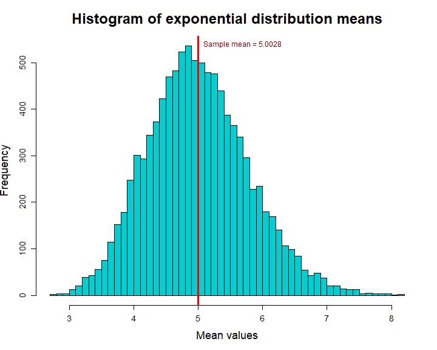
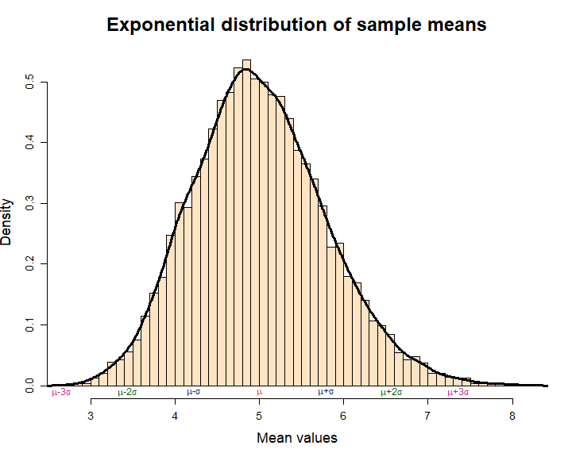

------------------------------------------------------------------------------------------------------------------

### Synopsis

This report investigates the **exponential distribution** in R and compares it with the **Central Limit Theorem (CLT)** 
by running a large number of simulations of the distribution defined by the R function **rexp(n, lambda)** for the mean 
of *40* exponentials. In this report, *10000* simulations are run. Lambda is the rate parameter of the distribution. The 
mean and standard deviation of the distribution are equal to **1/lambda**. A lambda value of *0.2* is taken for all 
simulations in this report.

### A sample exponential distribution

Let us first take a look at a sample exponential distribution of 40 exponentials with lambda value of 0.2: 


```r
set.seed(1)
nobs <- 40              # number of exponentials
lambda <- 0.2           # rate parameter or lambda

# a sample exponential distribution of 40 exponentials
plot(rexp(nobs, lambda), col = "blue", pch = 20, main = "Scatter plot of an exponential 
     distribution", xlab = "Number of exponentials (nobs)", 
     ylab = "rexp(nobs = 40, rate = 0.2)", cex.main = 2, cex.lab = 1.5, cex.axis = 1.2, 
     cex = 1.3, xlim = c(0, 40))
```


### Sample mean vs. Theoretical mean

The next step would be to perform 10000 simulations of the exponential distribution and then compute the mean for each 
of these 10000 simulations. 

The theoretical mean is equal to 1/lambda, which in our case would be equal to *5* (i.e. 1/0.2)

Computing the sample mean would be equivalent to running the expression **rexp(nobs, lambda)** 10000 times, computing a 
mean for each of those 10000 runs, and then again computing a single mean for those 10000 means. Fortunately, R makes 
life easier by giving us the power to compute the sample mean in two simple lines of code. The code chunk 
below shows the computation of the sample mean and plots a histogram of the exponential mean distribution:


```r
# 10000 simulations of the exponential distribution
dist <- sapply(1:10000, function(i) mean(rexp(nobs, lambda)))

# compute sample mean of the distribution
cat(paste0("Sample mean = ", round(mean(dist), 4)))
```

```
## Sample mean = 5.0028
```

```r
hist(dist, col = "darkturquoise", main = "Histogram of exponential distribution means", 
     xlab = "Mean values", cex.main = 2, cex.lab = 1.5, cex.axis = 1.2, breaks = 50)
abline(v = mean(dist), col = "red", lwd = 3)
text(5.7, 540, paste0("Sample mean = ", round(mean(dist), 4)), col = "darkred")
```



From the above computation we see that the sample mean is very close to 5, which is in good agreement with the 
theoretical mean value.

### Sample variance vs. Theoretical variance

The theoretical standard distribution of our sample is equal to **(1/lambda)/sqrt(nobs)**. The theoretical variance 
is the square of the theoretical standard deviation and will equate to **(1/lambda)^2/nobs**. 


```r
cat(paste(" Theoretical standard deviation = ", round((1/lambda)/sqrt(nobs), 4), "\n", 
          collapse = "\n", 
          "Sample standard deviation = ", round(sd(dist), 4), "\n", "\n",
          "Theoretical sample variance = ", round((1/lambda)^2/nobs, 4), "\n",
          "Sample variance = ", round(var(dist), 4)))
```

```
##  Theoretical standard deviation =  0.7906 
##  Sample standard deviation =  0.784 
##  
##  Theoretical sample variance =  0.625 
##  Sample variance =  0.6146
```

The sample variance also matches the theoretical variance value. 

### Is the distribution normal?

Take a look at the plot for the distribution of sample means of the exponentials:


```r
hist(dist, prob = TRUE, col = "bisque", main = "Exponential distribution of sample means", 
     xlab = "Mean values", cex.main = 2, cex.lab = 1.5, cex.axis = 1.2, breaks = 50)
lines(density(dist), col = "black", lwd = 3)
text(mean(dist), -0.01, expression(mu), col = "firebrick1")
text(mean(dist) + 1 * sd(dist), -0.01, expression(paste(mu, "+", sigma)), 
     col = "midnightblue")
text(mean(dist) - 1 * sd(dist), -0.01, expression(paste(mu, "-", sigma)), 
     col = "midnightblue")
text(mean(dist) + 2 * sd(dist), -0.01, expression(paste(mu, "+2", sigma)), 
     col = "darkgreen")
text(mean(dist) - 2 * sd(dist), -0.01, expression(paste(mu, "-2", sigma)), 
     col = "darkgreen")
text(mean(dist) + 3 * sd(dist), -0.01, expression(paste(mu, "+3", sigma)), 
     col = "violetred")
text(mean(dist) - 3 * sd(dist), -0.01, expression(paste(mu, "-3", sigma)), 
     col = "violetred")
```



The exponential distribution of sample means looks approximately symmetrical with the distribution centered around the 
sample mean, which resembles a normal distribution curve. This verifies the Central Limit Theorem (CLT) which states 
that the distribution of means of independent and identically distributed variables becomes that of a standard normal 
as the sample size increases. 

A published version of this report on RPubs can be found at **[this link][1]**.


<!--Set links below-->
[1]: https://rpubs.com/octopacks/exp_distribution
