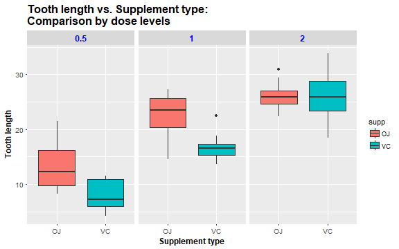
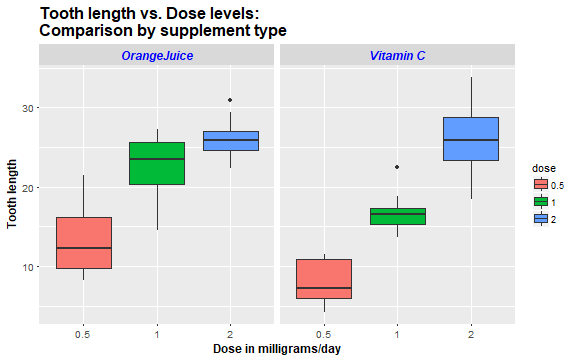

------------------------------------------------------------------------------------------------------------------

### Synopsis

This report performs a basic exploratory data analysis of the **ToothGrowth data** in the R **"datasets"** package. The 
data measures the effect of Vitamin C on tooth growth in 60 Guinea pigs. The response is the length of odontoblasts 
(which are cells responsible for tooth growth). Each animal received one of three dose levels of Vitamin C (0.5, 1 and 
2 mg/day) by one of two delivery methods, orange juice (OJ) or ascorbic acid (VC).^[1]^

### Loading & summarizing the data 

The ToothGrowth dataset is loaded into R and a brief summary of the data is shown below:


```r
library(datasets)       # load the datasets package
data("ToothGrowth")     # load the ToothGrowth dataset
attach(ToothGrowth)
summary(ToothGrowth)    # a basic summary of the ToothGrowth data
```

```
##       len        supp         dose      
##  Min.   : 4.20   OJ:30   Min.   :0.500  
##  1st Qu.:13.07   VC:30   1st Qu.:0.500  
##  Median :19.25           Median :1.000  
##  Mean   :18.81           Mean   :1.167  
##  3rd Qu.:25.27           3rd Qu.:2.000  
##  Max.   :33.90           Max.   :2.000
```

```r
table(ToothGrowth$dose, ToothGrowth$supp)
```

```
##      
##       OJ VC
##   0.5 10 10
##   1   10 10
##   2   10 10
```

The above table shows there are 30 observations each for the two supplement types and 10 observations each for the 
three dose levels i.e. a total of 60 observations in the data.The summary tells us that the tooth length ranges from 
4.20 to 33.90 with a median of 19.25 and mean of 18.81

### Exploratory data analyses

The below boxplots show some basic exploratory data analyses and help us gain more insight into the dataset.


```r
library(ggplot2)        # load the ggplot2 package

# plot of tooth length vs. supplement type compared by dose levels

ggplot(ToothGrowth, aes(x = supp, y = len)) + geom_boxplot(aes(fill = supp)) + 
    xlab("Supplement type") + ylab("Tooth length") + facet_grid(. ~ dose) + 
    theme(plot.title = element_text(size = 16, face = "bold")) +
    theme(axis.title.x = element_text(size = 12, face = "bold"), 
          axis.text.x = element_text(size = 10)) + 
    theme(axis.title.y = element_text(size = 12, face = "bold"), 
          axis.text.y = element_text(size = 10)) + 
    theme(strip.text = element_text(size = 12, color = "blue", face = "bold")) + 
    ggtitle("Tooth length vs. Supplement type:\nComparison by dose levels")
```




```r
# plot of tooth length vs. dose levels compared by supplement type

# change 'dose' from numeric to factor
ToothGrowth$dose <- as.factor(ToothGrowth$dose)

# rename levels of supplement type
levels(ToothGrowth$supp) <- c("OrangeJuice", "Vitamin C")

ggplot(ToothGrowth, aes(x = dose, y = len)) + geom_boxplot(aes(fill = dose)) + 
    xlab("Dose in milligrams/day") + ylab("Tooth length") + facet_grid(. ~ supp) + 
    theme(plot.title = element_text(size = 16, face = "bold")) +
    theme(axis.title.x = element_text(size = 12, face = "bold"), 
          axis.text.x = element_text(size = 10)) + 
    theme(axis.title.y = element_text(size = 12, face = "bold"), 
          axis.text.y = element_text(size = 10)) + 
    theme(strip.text = element_text(size = 12, color = "blue", face = "bold.italic")) + 
    ggtitle("Tooth length vs. Dose levels:\nComparison by supplement type")
```



### Hypothesis testing

To compare tooth growth by supplement type and dose amount, we will use a *t-test*.

- Comparison of tooth growth by supplement type: To test the **Null hypothesis H~0~** that the difference in means of tooth growth for the two supplement types OJ & VC is zero.


```r
# variances of tooth lengths for supplement type OJ
var(subset(ToothGrowth$len, supp == "OJ"))
```

```
## [1] 43.63344
```

```r
# variances of tooth lengths for supplement type VC
var(subset(ToothGrowth$len, supp == "VC"))
```

```
## [1] 68.32723
```

```r
t.test(len ~ supp, data = ToothGrowth, paired = FALSE, var.equal = FALSE)
```

```
## 
## 	Welch Two Sample t-test
## 
## data:  len by supp
## t = 1.9153, df = 55.309, p-value = 0.06063
## alternative hypothesis: true difference in means is not equal to 0
## 95 percent confidence interval:
##  -0.1710156  7.5710156
## sample estimates:
## mean in group OrangeJuice   mean in group Vitamin C 
##                  20.66333                  16.96333
```

The p-value for the above t-test is 0.06 which is greater than 5%, and the confidence interval contains 0. So we accept 
the null hypothesis that *the supplement type has no effect on tooth growth*.

- Comparison of tooth growth by dose amount: To test the **Null hypothesis H~0~** that the difference in means of tooth 
growth for a pair of dose amounts is zero.


```r
# variances of tooth lengths for dose amount 0.5
var(ToothGrowth$len[ToothGrowth$dose == 0.5])
```

```
## [1] 20.24787
```

```r
# variances of tooth lengths for dose amount 1.0
var(ToothGrowth$len[ToothGrowth$dose == 1.0])
```

```
## [1] 19.49608
```

```r
# variances of tooth lengths for dose amount 2.0
var(ToothGrowth$len[ToothGrowth$dose == 2.0])
```

```
## [1] 14.24421
```

```r
t.test(len ~ dose, data = subset(ToothGrowth, dose %in% c(0.5, 1.0)), var.equal = FALSE)
```

```
## 
## 	Welch Two Sample t-test
## 
## data:  len by dose
## t = -6.4766, df = 37.986, p-value = 1.268e-07
## alternative hypothesis: true difference in means is not equal to 0
## 95 percent confidence interval:
##  -11.983781  -6.276219
## sample estimates:
## mean in group 0.5   mean in group 1 
##            10.605            19.735
```

```r
t.test(len ~ dose, data = subset(ToothGrowth, dose %in% c(0.5, 2.0)), var.equal = FALSE)
```

```
## 
## 	Welch Two Sample t-test
## 
## data:  len by dose
## t = -11.799, df = 36.883, p-value = 4.398e-14
## alternative hypothesis: true difference in means is not equal to 0
## 95 percent confidence interval:
##  -18.15617 -12.83383
## sample estimates:
## mean in group 0.5   mean in group 2 
##            10.605            26.100
```

```r
t.test(len ~ dose, data = subset(ToothGrowth, dose %in% c(1.0, 2.0)), var.equal = FALSE)
```

```
## 
## 	Welch Two Sample t-test
## 
## data:  len by dose
## t = -4.9005, df = 37.101, p-value = 1.906e-05
## alternative hypothesis: true difference in means is not equal to 0
## 95 percent confidence interval:
##  -8.996481 -3.733519
## sample estimates:
## mean in group 1 mean in group 2 
##          19.735          26.100
```

The p-values of the t-tests for all three dose amount pairs are less than 5%, and the confidence intervals do not 
contain zero. So we reject the null hypothesis and conclude that *tooth growth increases with an increase in dose 
amount of Vitamin C*.

### Conclusions and Assumptions
*Conclusions*:

1. The supplement type (orange juice or ascorbic acid) has no effect on tooth growth in guinea pigs
2. Tooth growth in guinea pigs increase with an increase in dose levels of Vitamin C

*Assumptions*:

1. The sample of 60 guinea pigs is representative of the entire population
2. The distribution of sample means follows the Central Limit Theorem
3. The variances of the two groups being compared are different

A published version of this report on RPubs can be found at **[this link][2]**.

#### References:
[1]. *[R Documentation: The Effect of Vitamin C on Tooth Growth in Guinea Pigs][1]*


<!--Set links below-->
[1]: https://stat.ethz.ch/R-manual/R-devel/library/datasets/html/ToothGrowth.html

[2]: https://rpubs.com/octopacks/toothgrowth
